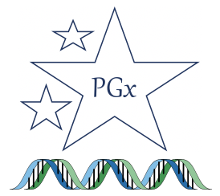

#### 

## StellarPGx: Calling star alleles in highly polymorphic pharmacogenes by leveraging genome graph-based variant detection.

Model gene: *CYP2D6*

Other CYP450 genes supported: *CYP2A6*, *CYP2B6*, *CYP2C19*, *CYP2C9*, *CYP2C8*, *CYP3A4*, *CYP3A5*, *CYP1A1*, *CYP1A2*, *CYP2E1*, *CYP4F2*

Non-CYP450 genes supported: *CYPOR* (*POR*)

StellarPGx is built using [`Nextflow`](https://www.nextflow.io), a workflow management system that facilitates parallelisation, scalability, reproducibility and portability of pipelines via [`Docker`](https://docs.docker.com) and [`Singularity`](https://sylabs.io/) technologies.

Please endeavour to always use the latest version of `StellarPGx`

Maintainer: David Twesigomwe (twesigomwedavid@gmail.com)


## Getting started

The following are required to run the StellarPGx pipeline;

1. Prerequisite software
    - [`Nextflow`](https://nf-co.re/usage/installation) (preferably v18.x or higher)
    - [`Singularity`](https://sylabs.io/) (v2.3.x or higher) or [`Docker`](https://docs.docker.com)
    
Singularity is highly recommended especially for running the pipeline in an HPC environment running Linux OS. Docker desktop is recommended for MacOS users intending to run/test the pipeline on a local machine. If you're just using your Mac to connect to a Linux cluster environment, then you can just proceed with Singularity on the cluster as the default.


2. Whole genome sequence (WGS) data
    - Indexed BAM/CRAM files
    
3. Reference genome
    - hg19, b37, or hg38
    
Note: For a full description of the differences among reference genomes, please check out this [`Documentation`](https://gatk.broadinstitute.org/hc/en-us/articles/360035890711-GRCh37-hg19-b37-humanG1Kv37-Human-Reference-Discrepancies) by the GATK team. For the purpose of using this pipeline, if the GRCh37 reference genome you are using has contigs that start with 'chr' (i.e. chr1, chr2, ..., chrX, chrM, ...), use the hg19 option. You should use the b37 option if the contigs in the GRCh37 reference genome do not have 'chr' (i.e. 1, 2, ..., X, MT). For GRCh38, the hg38 option is sufficient.


### Installation

#### Nextflow:

Install Nextflow by running the following command (Skip if you have Nextflow installed already):

```bash
curl -fsSL get.nextflow.io | bash
```

Move the `nextflow` launcher (installed in your current directory) to a directory in your $PATH e.g. $HOME/bin

```bash
mv nextflow $HOME/bin
```

(The full Nextflow documentation can be found [here](https://www.nextflow.io))


#### Singularity or Docker:

For Singularity installation, please refer to the excellent documentation [here](https://sylabs.io/guides/3.0/user-guide/installation.html)). Ensure that your Singularity installation allows `user defined binds` - set by your system administrator (See [Singularity config file](https://sylabs.io/guides/3.0/user-guide/installation.html) documentation) 


For Docker installation, please refer to the excellent documentation [here](https://docs.docker.com/get-docker))


#### StellarPGx repository:

Clone the StellarPGx repository by running the following command:

```bash
git clone https://github.com/SBIMB/StellarPGx.git && cd StellarPGx
```


## Running StellarPGx on the provided test dataset(s) - using Singularity (default)

The following steps assume that;
    i. StellarPGx is your current working directory
    ii. Nextflow and Singularity are already installed


### Step 1 - Parameters

The parameters for Singularity are set as default so no need to change anything.


### Step 2 - Execution of the pipeline

##### For execution on a local machine or single cluster node

```bash
nextflow run main.nf -profile standard,test
```

##### For execution on SLURM scheduler 

```bash
nextflow run main.nf -profile slurm,test
```


### Step 3 - Expected output

The expected output file (SIM001_2d6.alleles) for test dataset SIM001.bam will be found in the `./results/cyp2d6/alleles` directory. It should contain the following; 

```
--------------------------------------------

CYP2D6 Star Allele Calling with StellarPGx

--------------------------------------------

Initially computed CN = 2


Core variants:
42126611~C>G~1/1;42127608~C>T~0/1;42127941~G>A~1/1;42129132~C>T~0/1;42129770~G>A~0/1


Candidate alleles:
['17.v1_29.v1']


Result:
*17/*29


Activity score:
1.0


Metaboliser status:
Intermediate metaboliser (IM)

```


## Running StellarPGx on the provided test dataset(s) - using Docker

At the moment, only Docker Desktop on MacOS has been tested. The following steps assume that you have already installed Docker Desktop on your Mac as indicated above.


### Step 1 - Pull the Docker container

Pull the `stellarpgx-dev` container from Docker Hub by running the command below:

```bash
docker pull twesigomwedavid/stellarpgx-dev:latest
```

### Step 2 - Disable Singlularity(default) and enable Docker instead in the nextflow.config file


Enabling Docker in the nextflow.config file:

```bash
docker {
    enabled = true
    runOptions = '-u \$(id -u):\$(id -g)'
  }
```

Disabling Singularity in the nextflow.config file:

```bash
singularity {
    enabled = false
    autoMounts = true
    cacheDir = "$PWD/containers"
  }
```


Additionally, comment out the Singularity container variable (default) and set the variable `container` to point to the docker image instead i.e.

```bash

// container = "$PWD/containers/stellarpgx-dev.sif"  // this is to take the Singularity container out of the equation

container = "twesigomwedavid/stellarpgx-dev:latest" // this to set the container path to the Docker image containing all the dependencies that StellarPGx requires
```


### Step 3 - Execution on a local machine 
(Assumes that you're running Docker Desktop for MacOS)

```bash
nextflow run main.nf -profile standard,test
```


### Step 4 - Expected output

Similar to Singularity run.


## Running StellarPGx on your project data

#### Tip: 
Depending on your network connection to a computer cluster, it is highly recommended to run StellarPGx while using [`screen`](https://www.gnu.org/software/screen/) when analysing multiple samples so that in case your connection breaks, the jobs are not terminated midway through.


Once again, the following steps assume that;
    i. StellarPGx is your current working directory
    ii. Nextflow and Singularity or Docker are already installed
    

### Step 1 - Singularity vs Docker

Follow the aforementioned guidelines to decide between either Singularity or Docker. To reiterate, we recommend Docker for MacOS Desktop users. Singularity (default) is ideal for running StellarPGx on HPC cluster/server environments running Linux OS and also for Linux local machines.


    
### Step 2 - Set the input paths in the nextflow.config file

Set the parameters for your input data (`in_bam`) and the reference genome (`ref_file`) in the nextflow.config file following the syntax described therein. 

For single sample:

```bash
in_bam = "/path/to/Sample*{bam,bai}"
```

For all samples stored in the same directory (Advisable to create symlinks in the `data` directory if the samples are stored in various directories):

```bash
in_bam = "/path/to/*{bam,bai}"
```

Feel free to also specify samples with particular strings in their names:

```bash
in_bam = "/path/to/HG*{bam,bai}"
```

For CRAM input:

```bash
in_bam = "/path/to/samples/*{cram,crai}"
```

For reference genome:

```bash
ref_file = "/path/to/reference/genome.fasta"
```

Results directory:

Optionally, you may set the `out_dir` to a path of choice. The default output folder is `./results` under the StellarPGx directory. 


### Step 3 - Run the pipeline (Default is for GRCh38 aligned data)

For execution on a local machine

```bash
nextflow run main.nf -profile standard --build [hg38/b37/hg19] --gene [e.g. cyp2d6]
```

For execution via a scheduler e.g. SLURM 

```bash
nextflow run main.nf -profile slurm --build [hg38/b37/hg19] --gene [e.g. cyp2d6]
```

##### Using CRAM input

If you are using CRAM files as input, then ensure to supply the option `--format compressed`

```bash
nextflow run main.nf -profile [standard/slurm etc] --format compressed --build [hg38/b37/hg19] --gene [e.g. cyp2d6]
```


##### GRCh37 aligned data

In case your data is aligned to `b37` or `humanG1Kv37` (have contigs without 'chr' at the start), run the pipeline using the option `--build b37` option:

```bash
nextflow run main.nf -profile [standard/slurm etc] --build b37 --gene [e.g. cyp2d6]
```

If instead your data is aligned to `hg19` or `GRCh37` (have most/all contigs starting with 'chr') run the pipeline using the option `--build hg19` option:

```bash
nextflow run main.nf -profile [standard/slurm etc] --build hg19 --gene [e.g. cyp2d6]
```


### Step 4 - Results

See result files matching each sample in the `./results/<(gene)>` folder or custom predefined path.


Notice that there is a separate result-file for each sample and a separate results directory for each gene. We have included a handy script called `get_results_summary.sh` under ./scripts/general in order to facilitate getting the summary of allele calls after running StellarPGx. 

For example, if one wishes to get a summary of *CYP2D6* allele calls for each sample in the ./results/cyp2d6 folder after analysis, the following easy steps would produce a nice and simple summary table;

1. Copy the `get_results_summary.sh` script to the directory with the results files

```bash
cp path/to/scripts/general/get_results_summary.sh path/to/results/cyp2d6/
``` 

2. Run the get_results_summary.sh as follows;

```bash
bash get_results_summary.sh -s <sample-names-list> -o <output-file-name>
```


#### NB: 
Since `StellarPGx` is based on `Nextflow`, a directory called `work` is created each time you run the pipeline. The `work` directory is primarily useful for debugging purposes as it contains the input, output, script details and error report for each process in the pipeline. Remember to delete these `work` directories after your analysis to save space on your disk.    


## Citation

If you use StellarPGx in your PGx analysis, please cite our recently accepted article:

David Twesigomwe, Britt I. Drögemöller, Galen E.B. Wright, Azra Siddiqui, Jorge da Rocha, Zané Lombard and Scott Hazelhurst. StellarPGx: A Nextflow pipeline for calling star alleles in cytochrome P450 genes. *Clinical Pharmacology and Therapeutics*. [doi:10.1002/cpt.2173](https://ascpt.onlinelibrary.wiley.com/doi/abs/10.1002/cpt.2173). [Epub ahead of print].


## License

MIT License


Thank you for choosing StellarPGx :nerd_face:


